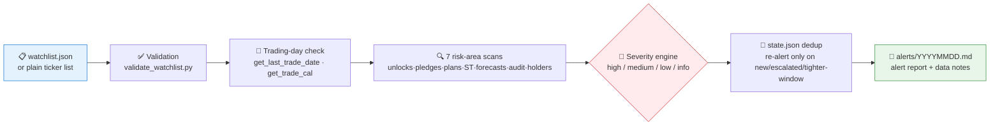

# 🚨 Event Risk Alert Skill

[简体中文](README.md) | **English**

**Creator / Maintainer**: [abgyjaguo](https://github.com/abgyjaguo)

> Turn an A-share watchlist or portfolio into a traceable event-risk scan: restricted-share unlocks, equity pledges, shareholder increase/decrease plans, ST status changes, earnings forecasts, audit opinions, and holder-count shifts — 7 risk areas, graded alerts, scheduled monitoring.

<p align="center">
  
  
  
  
  
</p>

---

## 📖 What is this

`event-risk-alert` is an **Agent Skill**: feed it a watchlist (`watchlist.json` or plain ticker list) and it scans **7 event-risk areas** — one-off or on a schedule — producing alert reports graded `high / medium / low / info`.

It solves two core problems — **traceability and alert fatigue**:

- every alert carries its source method, query parameters, event date, and trigger rule, with raw fields preserved for audit;
- a state file de-duplicates alerts — it re-alerts only on **new events, severity escalation, or a key date entering a tighter window**, so the same unlock announcement doesn't ping you every morning.

> All data contracts come from the sibling skill [`pandadata-api`](https://github.com/quantskills/skill-pandadata-api): parameters and fields are verified first; signatures are never guessed, interfaces never invented.

---

## ⚡ Scan Pipeline



---

## 🗂️ Seven Risk Areas × Method Map

| Risk area | Primary methods | Default scan logic |
|---|---|---|
| 🔓 **Restricted unlocks** | `get_restricted_list` | Look ahead 30 days by `relieve_date`; escalate large or imminent unlocks |
| 🔒 **Equity pledges** | `get_stock_pledge` · `get_stock_pledge_stat` | Track new pledges, releases, accumulated pledge ratios; escalate high exposure |
| 📉 **Shareholder plans** | `get_stock_shareholder_change` | Flag new reduction plans, controller/officer reductions, large planned ratios, status changes |
| ⚠️ **ST / delisting risk** | `get_stock_status_change` | Flag new ST, *ST, delisting-risk warnings and withdrawals by `change_date` and `type` |
| 📊 **Earnings forecasts** | `get_fina_forecast` | Flag losses, first losses, continued losses, sharp downward revisions, negative profit ranges |
| 🧾 **Audit opinions** | `get_audit_opinion` | Escalate non-standard opinions and internal-control issues; standard rows are context only |
| 👥 **Holder count** | `get_holder_count` | Compare latest two disclosed periods; flag sharp increases suggesting ownership dispersion |

---

## 🚦 Default Severity Rules

Thresholds can be overridden via the watchlist `rules` object:

| Risk area | 🔴 High | 🟡 Medium | 🟢 Low / Info |
|---|---|---|---|
| Restricted unlock | Unlock within 7 days, or unlocked shares > 5% of float | Unlock within 30 days, or newly disclosed for a watched holding | Older unlocks outside the active window |
| Equity pledge | Accumulated pledge ratio ≥ 50%, or very large new controller pledge | Accumulated ratio ≥ 30%, or material new pledge | Releases, small pledges, no ratio available |
| Shareholder reduction | Controller / director / officer / large-holder plan with ratio ≥ 1% | Any new reduction plan or negative progress update | Increase plans, completed plans, minor reductions |
| ST / delisting | New ST, *ST, delisting-risk warning, trading termination | Status change of uncertain severity, withdrawal needing follow-up | Clearly positive warning withdrawal |
| Earnings forecast | Loss, first loss, continued loss, sharp revision, negative range | Large decline, weak wording, range crossing zero | Positive or neutral forecast |
| Audit opinion | Qualified / adverse / disclaimer / emphasis of matter / internal-control issue | Missing agency or opinion where one is expected | Unqualified opinion |
| Holder count | Latest period up ≥ 20% vs prior | Up ≥ 10% | Decline or small change |

---

## 📋 Watchlist Contract

Prefer `watchlist.json` (every field except `symbol` is optional):

```json
{
  "as_of": "2026-06-12",
  "symbols": [
    {
      "symbol": "000001.SZ",
      "name": "Ping An Bank",
      "position_cost": 10.25,
      "tags": ["core-holding"]
    }
  ],
  "rules": {
    "restricted_unlock_days": 30,
    "high_unlock_float_pct": 5,
    "medium_pledge_total_ratio": 30,
    "high_pledge_total_ratio": 50,
    "holder_count_increase_pct": 20
  }
}
```

Validate before scanning (symbol format, date format, duplicates, rule-override keys):

```bash
python scripts/validate_watchlist.py watchlist.json
# [ok] watchlist.json contains 1 symbol(s)
```

---

## 🔁 State Dedup & Scheduled Monitoring

- State lives in `alerts/state.json`: keyed by `symbol|event_type|event_date|party`, recording `severity / first_seen / last_seen`;
- repeated events only update `last_seen`; a new alert fires on **unseen keys, severity escalation, or a date entering a tighter window**;
- before creating any runtime automation, write a monitor spec: timezone, cadence, watchlist path, push channels, idempotency rules, stale-data handling;
- recommended cadence: **daily pre-open** for new disclosures and upcoming unlocks, **weekly full review** for pledges, audit opinions, and holder counts.

---

## 🚀 Quick Start

### 1️⃣ Install (together with pandadata-api)

```bash
# Claude Code (global)
cp -r skill-pandadata-api    ~/.claude/skills/pandadata-api
cp -r skill-event-risk-alert ~/.claude/skills/event-risk-alert

# Codex (global, Agent Skills standard directory recommended)
mkdir -p ~/.agents/skills
cp -r skill-pandadata-api    ~/.agents/skills/pandadata-api
cp -r skill-event-risk-alert ~/.agents/skills/event-risk-alert

# Cursor (project level)
mkdir -p .cursor/skills
cp -r skill-pandadata-api    .cursor/skills/pandadata-api
cp -r skill-event-risk-alert .cursor/skills/event-risk-alert
```

### 2️⃣ Ask in natural language

```text
监控我的持仓风险：000001.SZ、600519.SH、300750.SZ
未来30天我的自选股里有哪些解禁？质押率高不高？
帮我设置每天盘前的持仓事件风险扫描，只推送高/中风险
```

### 3️⃣ Report structure

```
Severity summary (high/medium/low counts) → High & medium alert table → Per-event detail
→ Data notes (empty results · disclosure lag · failed calls) → Monitoring disclaimer
```

Each alert includes: symbol, name, severity, event type, source method, query parameters, event date, announcement date, trigger rule, key raw values, and next monitoring date.

---

## 📦 Directory Layout

```
event-risk-alert/
├── SKILL.md                              # Skill entry: core rules, workflow, method map, watchlist contract
├── references/
│   └── event-risk-alert-guide.md         # 📒 Event normalization, severity rules, state file, report template, monitor spec
├── scripts/
│   └── validate_watchlist.py             # ✅ watchlist.json validator
└── agents/
    ├── openai.yaml                       # OpenAI/Codex adapter
    ├── cursor-rule.mdc                   # Cursor project-rule adapter
    └── portable-loader.md                # Generic loader for agents without native skill discovery
```

### Cross-Agent Use

| Runtime | How |
|---|---|
| Claude Code / Codex | Load this folder directly (`$event-risk-alert`) |
| Cursor | Use `agents/cursor-rule.mdc` as project rule; keep the folder under `.cursor/skills/event-risk-alert` |
| Hermes | Keep the folder under `.hermes/skills/finance/event-risk-alert`, or use `agents/portable-loader.md` |
| OpenClaw | Keep the folder under `.openclaw/skills/event-risk-alert`, or use `agents/portable-loader.md` |
| Other agents | Paste `agents/portable-loader.md` as the loader prompt |

---

## 📐 Core Constraints

| Constraint | Description |
|---|---|
| 🧾 Contract first | Every real call is verified against `pandadata-api` for parameters, fields, units, date formats |
| 📅 Absolute dates | Reports and monitor specs use absolute dates like `2026-06-12`; Pandadata `YYYYMMDD` is converted for humans |
| 🔍 Traceable | Every material claim carries source method, query window, data/event date, raw vs calculated label |
| 🔁 Dedup before re-alert | Alerts are de-duplicated against prior state; re-alert only on new/escalated/tighter-window events or full rescans |
| 🕳️ Report empty data honestly | Empty results, disclosure lags, failed calls, and skipped methods all go into "Data Notes" — never silently dropped |
| 🗣️ No trading instructions | No personalized trade orders; formal alerts end with a data-monitoring / research-support note |

---

## ⚠️ Disclaimer

This skill produces data-monitoring and research-support output only. Nothing here constitutes investment advice.

## 🐼 PandaAI / QUANTSKILLS Community

<div align="center">
  
  <br>
  <sub>Scan the QR code to join the PandaAI community for QUANTSKILLS skills, agent workflows, and quantitative research practice.</sub>
</div>
