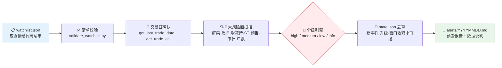

# 🚨 Event Risk Alert Skill

**简体中文** | [English](README.en.md)

**创建者 / 维护者**：[abgyjaguo](https://github.com/abgyjaguo)

> 把一份 A 股自选/持仓清单，变成可追溯的事件风险扫描：解禁、质押、增减持、ST 变更、业绩预告、审计意见、股东户数 —— 7 大风险面一次排查，分级预警，定时监控。

<p align="center">
  
  
  
  
  
</p>

---

## 📖 这是什么

`event-risk-alert` 是一个 **Agent Skill**：输入一份自选股/持仓清单（`watchlist.json` 或直接给代码），对 **7 大事件风险面**做一次性扫描或定时监控，输出按 `high / medium / low / info` 分级的预警报告。

它解决的核心问题是**风险事件的可追溯与不重复打扰**：

- 每条预警都标注来源接口、查询参数、事件日期与触发规则，原始字段留底可审计；
- 用状态文件去重 —— 只在**新事件、等级上升、关键日期进入更紧的窗口**时才再次提醒，避免每天重复轰炸同一条解禁公告。

> 数据契约一律来自姊妹技能 [`pandadata-api`](https://github.com/quantskills/skill-pandadata-api)：先核对方法参数与字段，不猜签名、不发明接口。

---

## ⚡ 扫描流水线



---

## 🗂️ 七大风险面 × 接口映射

| 风险面 | 主要接口 | 默认扫描逻辑 |
|---|---|---|
| 🔓 **限售解禁** | `get_restricted_list` | 按 `relieve_date` 前瞻 30 天；大额解禁或临近报告日的解禁升级预警 |
| 🔒 **股权质押** | `get_stock_pledge` · `get_stock_pledge_stat` | 跟踪新增质押、解除质押与累计质押比例；累计比例高企时升级 |
| 📉 **股东增减持** | `get_stock_shareholder_change` | 标记新减持计划、控股股东/董监高减持、大比例计划与进度变化 |
| ⚠️ **ST / 退市风险** | `get_stock_status_change` | 按 `change_date` 与 `type` 标记新 ST、*ST、退市风险警示及撤销 |
| 📊 **业绩预告** | `get_fina_forecast` | 标记预亏、首亏、续亏、大幅下修与净利区间为负 |
| 🧾 **审计意见** | `get_audit_opinion` | 非标意见、内控审计问题升级；标准意见仅作背景不报警 |
| 👥 **股东户数** | `get_holder_count` | 对比最近两个披露期；户数骤增提示筹码分散 |

---

## 🚦 默认分级规则

阈值可由 watchlist 的 `rules` 字段覆盖：

| 风险面 | 🔴 High | 🟡 Medium | 🟢 Low / Info |
|---|---|---|---|
| 限售解禁 | 7 天内解禁，或解禁股超流通盘 5% | 30 天内解禁，或持仓股新披露解禁 | 窗口外的旧解禁 |
| 股权质押 | 累计质押比例 ≥ 50%，或控股股东大额新增质押 | 累计比例 ≥ 30%，或新增质押金额较大 | 解押、小额质押、无比例数据 |
| 股东增减持 | 控股股东/实控人/董监高/大股东减持计划且比例 ≥ 1% | 任何新减持计划或负面进度更新 | 增持计划、已完成历史计划、小额减持 |
| ST / 退市 | 新 ST、*ST、退市风险警示、终止上市 | 严重性不明的状态变更、需跟踪的撤销 | 明确利好的警示撤销 |
| 业绩预告 | 预亏、首亏、续亏、大幅下修、净利区间为负 | 大幅预减、措辞偏弱、区间跨零 | 正面或中性预告 |
| 审计意见 | 保留/否定/无法表示意见、强调事项、内控问题等非标 | 应有意见的报告缺失机构/意见 | 标准无保留意见 |
| 股东户数 | 最新披露期较上期增加 ≥ 20% | 增加 ≥ 10% | 下降或小幅变化 |

---

## 📋 Watchlist 契约

推荐使用 `watchlist.json`（除 `symbol` 外其余字段均可选）：

```json
{
  "as_of": "2026-06-12",
  "symbols": [
    {
      "symbol": "000001.SZ",
      "name": "平安银行",
      "position_cost": 10.25,
      "tags": ["core-holding"]
    }
  ],
  "rules": {
    "restricted_unlock_days": 30,
    "high_unlock_float_pct": 5,
    "medium_pledge_total_ratio": 30,
    "high_pledge_total_ratio": 50,
    "holder_count_increase_pct": 20
  }
}
```

扫描前先校验（检查代码格式、日期格式、重复代码、规则覆盖项是否合法）：

```bash
python scripts/validate_watchlist.py watchlist.json
# [ok] watchlist.json contains 1 symbol(s)
```

---

## 🔁 状态去重与定时监控

- 状态存于 `alerts/state.json`：以 `代码|事件类型|事件日期|主体` 为键记录 `severity / first_seen / last_seen`；
- 重复事件只更新 `last_seen`；**新事件、等级上升、事件日期进入更紧窗口**时才再次推送；
- 建立定时任务前先写监控规格：时区、频率、watchlist 路径、推送渠道、幂等规则、过期数据处理；
- 推荐节奏：**每日盘前**扫新披露事件与临近解禁，**每周全面复查**质押、审计意见、股东户数。

---

## 🚀 快速开始

### 1️⃣ 安装（与 pandadata-api 一起）

```bash
# Claude Code（全局）
cp -r skill-pandadata-api    ~/.claude/skills/pandadata-api
cp -r skill-event-risk-alert ~/.claude/skills/event-risk-alert

# Codex（全局，推荐 Agent Skills 标准目录）
mkdir -p ~/.agents/skills
cp -r skill-pandadata-api    ~/.agents/skills/pandadata-api
cp -r skill-event-risk-alert ~/.agents/skills/event-risk-alert

# Cursor（项目级）
mkdir -p .cursor/skills
cp -r skill-pandadata-api    .cursor/skills/pandadata-api
cp -r skill-event-risk-alert .cursor/skills/event-risk-alert
```

### 2️⃣ 直接用自然语言提问

```text
监控我的持仓风险：000001.SZ、600519.SH、300750.SZ
未来30天我的自选股里有哪些解禁？质押率高不高？
帮我设置每天盘前的持仓事件风险扫描，只推送高/中风险
```

### 3️⃣ 报告结构

```
分级汇总（high/medium/low 计数） → 高/中风险预警表 → 逐条事件明细
→ 数据说明（空结果·披露滞后·失败调用） → 监测声明
```

每条预警包含：代码、名称、等级、事件类型、来源接口、查询参数、事件日期、公告日期、触发规则、关键原始值、下次监控日期。

---

## 📦 目录结构

```
event-risk-alert/
├── SKILL.md                              # 技能入口：核心规则、工作流、接口映射、watchlist 契约
├── references/
│   └── event-risk-alert-guide.md         # 📒 事件标准化字段、默认分级规则、状态文件、报告模板、监控规格
├── scripts/
│   └── validate_watchlist.py             # ✅ watchlist.json 校验脚本
└── agents/
    ├── openai.yaml                       # OpenAI/Codex 适配
    ├── cursor-rule.mdc                   # Cursor 项目规则适配
    └── portable-loader.md                # 无原生 skill 发现能力的 Agent 通用加载器
```

### 跨 Agent 使用

| 运行时 | 方式 |
|---|---|
| Claude Code / Codex | 直接加载本文件夹（`$event-risk-alert`） |
| Cursor | `agents/cursor-rule.mdc` 作项目规则，完整文件夹放 `.cursor/skills/event-risk-alert` |
| Hermes | 完整文件夹放 `.hermes/skills/finance/event-risk-alert`，或用 `agents/portable-loader.md` |
| OpenClaw | 完整文件夹放 `.openclaw/skills/event-risk-alert`，或用 `agents/portable-loader.md` |
| 其他 Agent | 粘贴 `agents/portable-loader.md` 作加载提示词 |

---

## 📐 核心约束

| 约束 | 说明 |
|---|---|
| 🧾 先查契约 | 真实调用前先经 `pandadata-api` 核对参数、字段、单位、日期格式，不猜签名 |
| 📅 绝对日期 | 报告与监控规格一律用 `2026-06-12` 这类绝对日期；Pandadata 的 `YYYYMMDD` 转为人类可读格式 |
| 🔍 可溯源 | 每条实质性结论标注来源方法、查询窗口、数据/事件日期，并区分原始值与计算值 |
| 🔁 去重再报 | 有状态时对历史预警去重；仅新事件、升级、窗口收紧或用户要求全量重扫时再报 |
| 🕳️ 空数据如实报 | 空结果、披露滞后、调用失败、按范围跳过的方法都写进"数据说明"，不静默吞掉 |
| 🗣️ 不给操作指令 | 不提供个性化交易指令；正式预警以"数据监测与研究支持"声明结尾 |

---

## ⚠️ 免责声明

本技能输出为基于数据监测规则的研究支持信息，不构成任何投资建议。

## 🐼 PandaAI / QUANTSKILLS 社群

<div align="center">
  
  <br>
  <sub>扫码加入 PandaAI 社群，交流 QUANTSKILLS 技能、Agent 工作流与量化研究实践。</sub>
</div>
